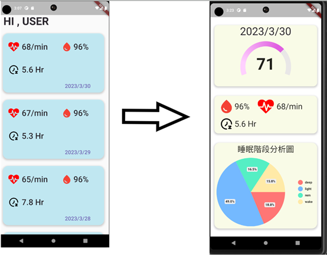

# 高科大APP程式設計期末作業 fitbit 數據監控程式

## 功能
首頁可以讀取CSV檔案並且顯示出來，點擊之後可以跳轉到詳細資料頁面


## 依賴庫
``` yaml
dependencies:
  syncfusion_flutter_gauges: ^21.2.10
  pie_chart: ^5.3.2
  intl: ^0.18.1
  flutter_svg: ^2.0.6
  csv: ^5.0.1
```
## 內部資料
1. `./assets/data`  : 存放.csvdata
2. `./assets/images`: 存放各式img icon

## 頁面
1. `main.dart` : 主程式
    - 呼叫`widget/block.dart`，用於渲染每筆睡眠的資料
    - 跳轉`viewpage.dart`，顯示睡眠資料詳情
2. `viewpage.dart` : 詳情程式
    - 呼叫`widget/gauge.dart`，用於渲染score圖形
    - 呼叫`widget/piechart.dart`，用於渲染睡眠時長的圓餅圖